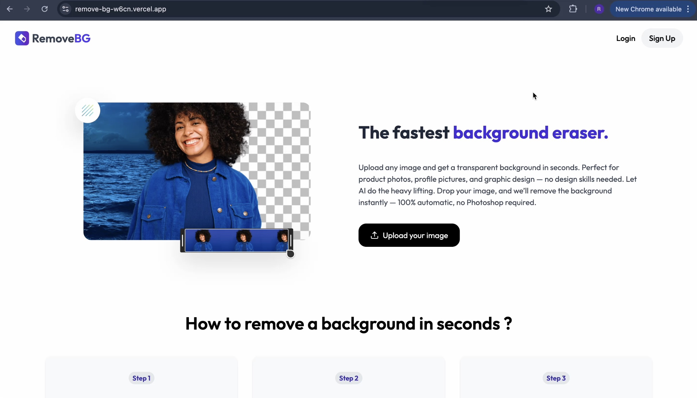
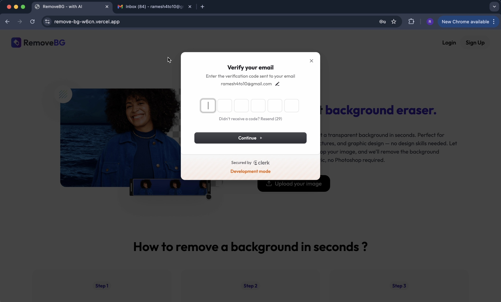
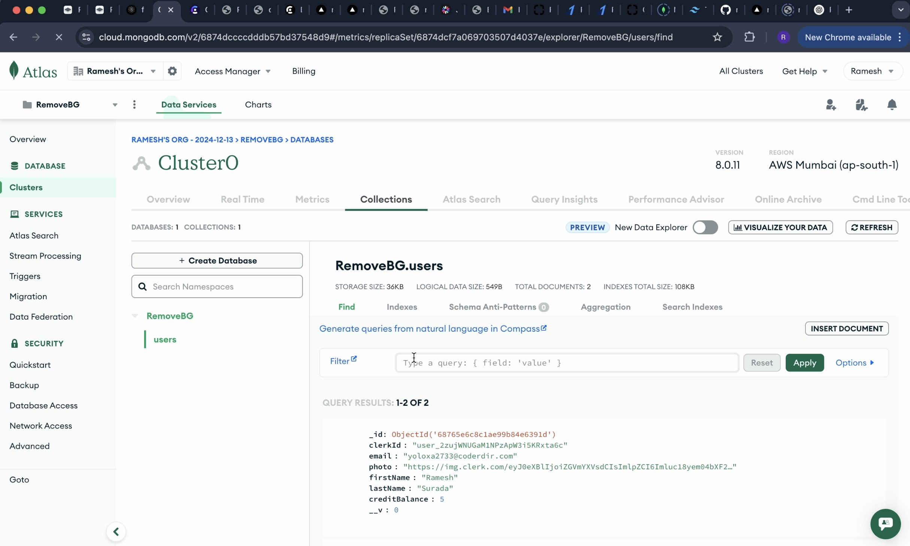
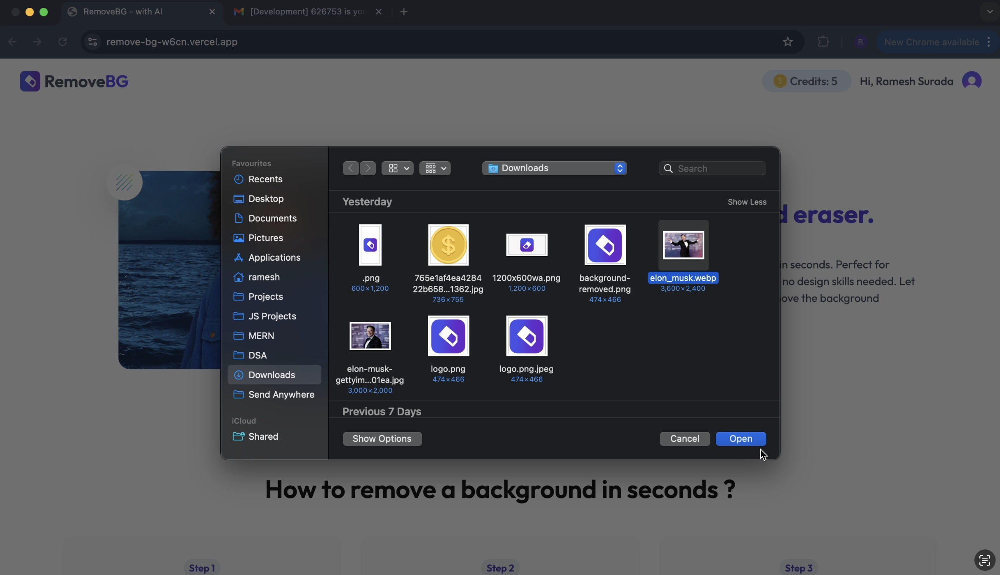
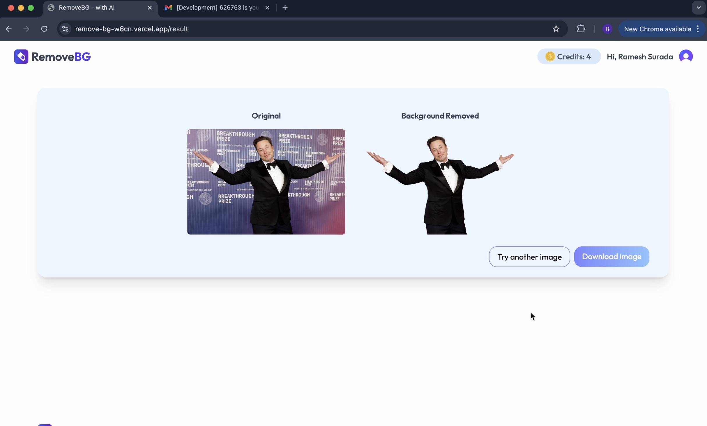
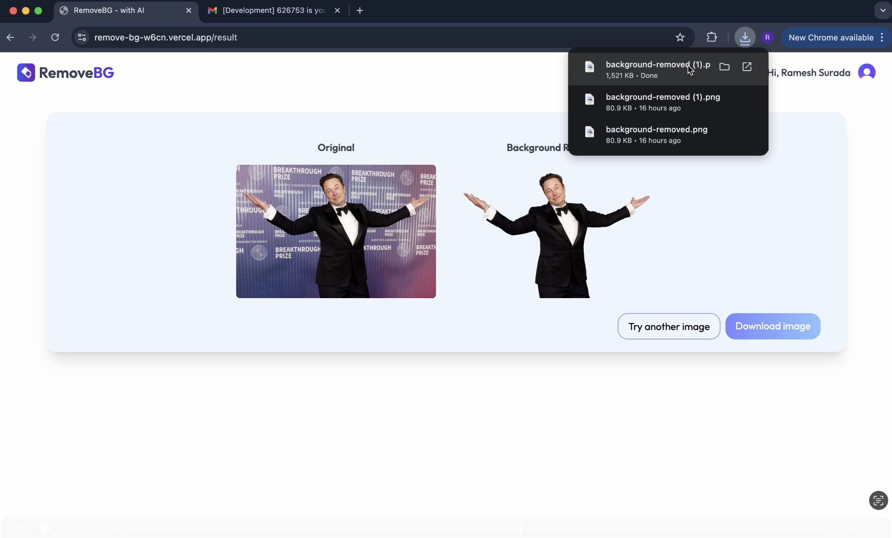
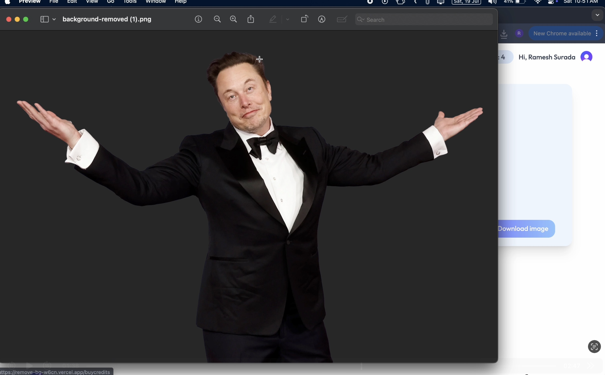
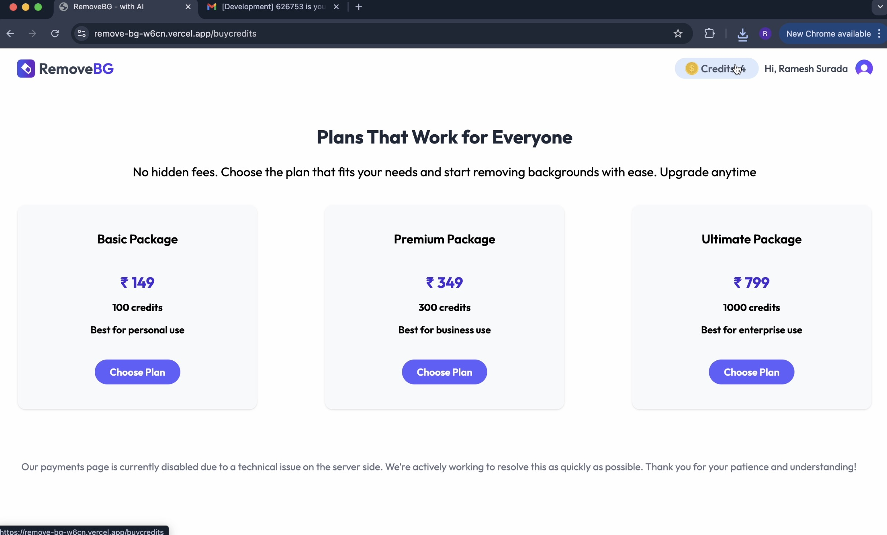

# RemoveBG 🖼️🚀

RemoveBG is a full-stack AI SaaS web app that allows users to remove image backgrounds instantly using AI. Built with the MERN stack and powered by the ClipDrop API, it offers seamless Google login and phone OTP authentication via Clerk.

---

## ⚙️ How It Works

1. **Sign Up / Log In**  
   Users create an account by entering their first name, last name, and either an email or phone number — or simply sign in using Google. Authentication is handled securely via Clerk, supporting both Google login and phone OTP verification.

2. **Verify OTP**  
   After signup, users verify their account by entering a One-Time Password (OTP) sent to their phone or email, ensuring secure access.

3. **Upload Image**  
   Once authenticated, users can upload an image from their local device through a simple and responsive interface.

4. **AI Background Removal**  
   The uploaded image is sent to the ClipDrop API, which uses AI to accurately remove the background in seconds.

5. **View & Download Result**  
   Users see a side-by-side comparison of the original image and the background-removed version, with the option to download the processed image directly to their device.

6. **Pricing & Usage**  
   Users can view the pricing page to understand available plans and limits, making it easy to manage usage according to their needs.

7. **Data Storage**  
   All user data including account details and usage history are securely stored in MongoDB.

---

## ✨ Features

- 🔍 AI-powered background removal via ClipDrop API  
- 🔐 Secure authentication using Clerk (Google login + Phone OTP)  
- 🖼️ Upload and preview images before and after removal  
- ⚡ Fast and mobile-responsive design using Tailwind CSS  

---

## 🛠️ Tech Stack

- Frontend: React, Tailwind CSS  
- Backend: Node.js, Express.js  
- Database: MongoDB  
- Authentication: Clerk (Google login, Phone OTP)  
- API: ClipDrop API  
- Hosting: Vercel  

---

## 📸 Screenshots

### 1. 🏠 Home Page  

### 2. 🔑 Login / Signup Page  

### 3. 🔐 OTP Verification Page  

### 4. 🗃️ MongoDB Collections View  

### 5. 🖼️ Image Upload Page  

### 6. ✂️ Background Removal Result Page  

### 7. ⬇️ Download Image Option  

### 8. 🖼️ Image View in Local Disk  

### 9. 💳 Pricing Page  

---

## 🔗 Links

- **Live App:** [https://remove-bg-w6cn.vercel.app/](https://remove-bg-w6cn.vercel.app/)  
- **GitHub Repo:** [https://github.com/rameshsurada/RemoveBG](https://github.com/rameshsurada/RemoveBG)  

---

## 🤝 Contributing

Contributions, feedback, and ideas are welcome!

---

## 📫 Contact

Connect with me on [LinkedIn](https://www.linkedin.com/in/rameshsurada/)  
Or reach out via email: suradaramesh4@gmail.com

---
